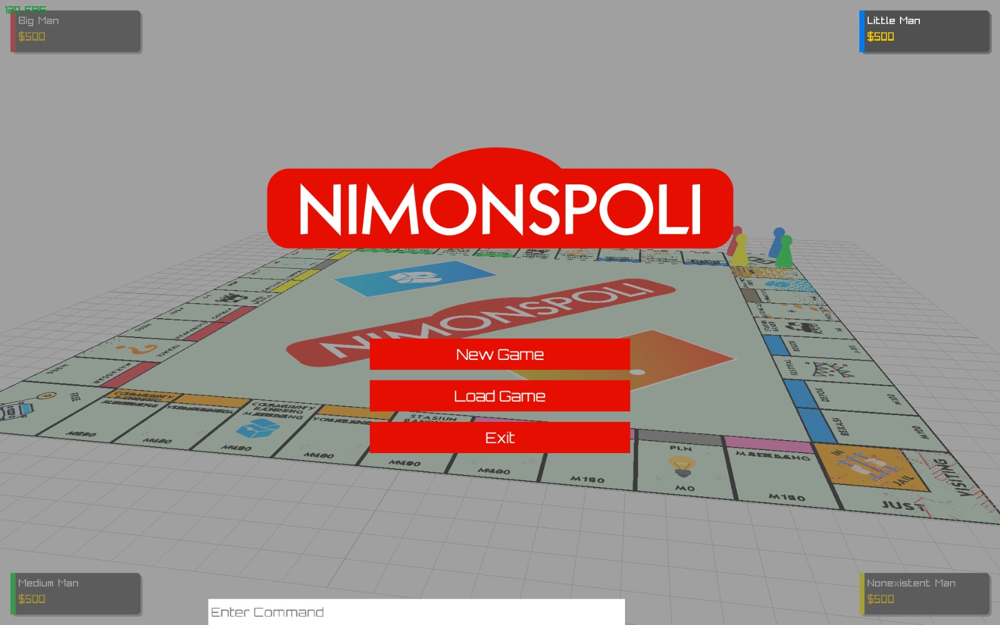

# Nimonspoli
> Tugas Besar 1 IF2010 Pemrograman Berorientasi Objek.  

<p align="center">
  
</p>

Project ini adalah implementasi game papan bergaya Monopoly dengan arsitektur OOP C++ dan GUI berbasis Raylib.

## Tech Stack

- C++17
- CMake
- Raylib
- OpenGL (via Raylib)

## Tim Pengembang

- **Kode Kelompok**: GDT
- **Nama Kelompok**: Go Directly to Tubes
- **Anggota**:
  - 13524015 - Mahatma Brahmana
  - 13524053 - Muhammad Haris Putra Sulastianto
  - 13524057 - Benedict Darrel Setiawan
  - 13524059 - Raymond Jonathan Dwi Putra J
  - 13524111 - Reynard Anderson Wijaya

## Build & Run (Windows)

### Prasyarat

- CMake 3.11+
- Compiler C++ yang mendukung C++17
- Raylib sudah terpasang (sesuai environment lokal)
- Konfigurasi include/lib Raylib pada `CMakeLists.txt` valid untuk mesin yang dipakai

### Contoh Konfigurasi Raylib (CMake)

```cmake
include_directories(C:/msys64/ucrt64/include)
link_directories(C:/msys64/ucrt64/lib)

target_link_libraries(${PROJECT_NAME}
    raylib
    opengl32
    gdi32
    winmm
)
```

Jika Raylib terpasang di lokasi berbeda, ubah path berikut:

- `include_directories(...)`
- `link_directories(...)`

Contoh (custom install path):

```cmake
include_directories(D:/libs/raylib/include)
link_directories(D:/libs/raylib/lib)
```

### Build

```bash
cmake -S . -B build
cmake --build build
```

### Run

```bash
./build/Nimonspoli
```

Jika executable memiliki ekstensi:

```bash
./build/Nimonspoli.exe
```

## Struktur Folder Inti

- `src/core` : game loop, engine, turn manager, command processor, auction/bankruptcy manager
- `src/models` : model domain (player, property, board/tile, card/deck)
- `src/views` : GUI utama
- `src/views/viewElement` : komponen UI (HUD, popup, inventory, board element, cards, player view)
- `include` : header untuk seluruh module
- `data` : asset GUI/3D dan data pendukung

### Gambaran Path Repository

```text
root
|- CMakeLists.txt
|- README.md
|- data/
|  |- GUIAssets/
|- include/
|  |- core/
|  |- exception/
|  |- models/
|  |- utils/
|  |- views/
|- src/
|  |- core/
|  |- exception/
|  |- models/
|  |- utils/
|  |- views/
|     |- animation/
|     |- viewElement/
|        |- board/
|        |- cards/
|        |- player/
|        |- property/
|- build/ (generated by CMake)
```